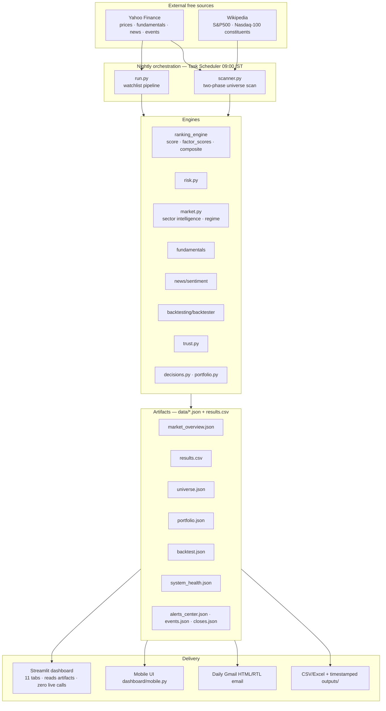
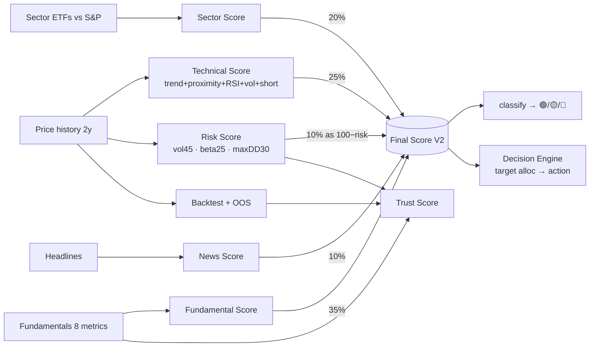

# ARCHITECTURE_DIAGRAM

Two views: (1) component/data-flow, (2) the scoring pipeline. Rendered as Mermaid
(GitHub/most Markdown viewers render these natively).

## 1. Component & data flow

## 2. Scoring pipeline (per stock → Final Score V2)

> Weights renormalize over available dimensions when a factor is missing
> (e.g. a bank with no fundamentals) — a stock is never zero-filled.
> See `SCORE_ENGINE.md` for exact formulas.
