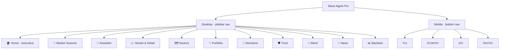
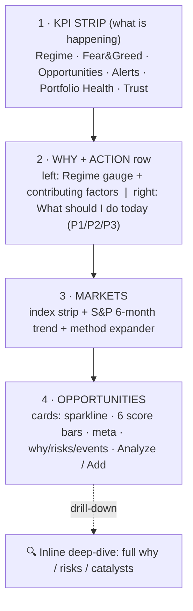

# INFORMATION ARCHITECTURE — Phase 17

The redesign keeps the same data and navigation but re-prioritizes **what the eye
hits first**. Every screen now answers, top-to-bottom: *What is happening? → Why? →
What should I do?*

## Navigation map

## Home screen hierarchy (the redesigned screen)

## The three-question model (applied per screen)

| Screen | What is happening? | Why? | What should I do? |
|---|---|---|---|
| Home | KPI strip + regime gauge | contributing factors, S&P trend | "What to do today" action cards |
| Sectors | heatmap of sector scores | trend / momentum / RS columns | overweight / underweight labels |
| Portfolio | value, health, beta KPIs | exposure + correlation charts | suggested actions, constraint warnings |
| Alerts | severity-sorted cards | description per alert | recommended action line |

## What changed vs. did not

- **Changed:** layout, hierarchy, color system, typography, component styling, the
  Home composition, drill-down interactions, mobile bottom-nav.
- **Unchanged:** all business logic, scores, artifacts, data flow, and the
  11-tab / 4-tab navigation structure. No new investment features.
